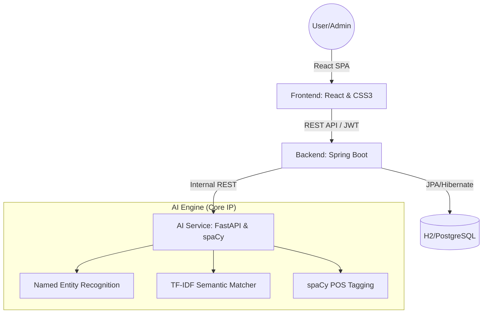

# CareerIQ: AI-Powered Resume Acceleration Platform
> **Scientific Approach to Career Growth & Hiring Precision**

## 1. Executive Summary
CareerIQ is a sophisticated, polyglot microservices application designed to solve the "Black Box" problem of Applicant Tracking Systems (ATS). While standard tools use simple keyword matching, CareerIQ employs **Semantic NLP (Natural Language Processing)** to understand the *impact* and *context* of a candidate's experience, providing real-time auditing and interview preparation.

---

## 2. High-Level Architecture
The system follows a modern decoupled architecture, separating the heavy data processing (AI) from the business logic (Java) and the user interface (React).

---

## 3. The Tech Stack (Polyglot Engineering)

### **Frontend: The User Experience**
- **Framework**: React.js 18.
- **Styling**: Vanilla CSS3 with **Glassmorphism** aesthetics.
- **State Management**: React Hooks (useState, useEffect).
- **Communication**: Axios with interceptors for JWT handling.
- **Optimization**: "Pre-warm" ping strategy to mitigate cloud cold starts.

### **Backend: The Core Logic (Java)**
- **Framework**: Spring Boot 3.x.
- **Security**: Stateless **JWT (JSON Web Token)** authentication.
- **Persistence**: Spring Data JPA with Hibernate.
- **Database**: H2 for development stability; PostgreSQL-ready for production scaling.
- **Performance**: Asynchronous processing for file handling.

### **AI Service: The Intelligence (Python)**
- **Framework**: FastAPI (High-performance Python web framework).
- **NLP Engine**: **spaCy** (Professional-grade Natural Language Processing).
- **Machine Learning**: **Scikit-Learn** for TF-IDF Vectorization.
- **Text Extraction**: PyMuPDF (High-fidelity PDF parsing).

---

## 4. Deep-Dive: Core Technical Innovations

### **A. Real NLP vs. Simple Strings**
Unlike competitors that look for exact words (e.g., "Java"), CareerIQ uses **Lemmatization** and **POS (Part-of-Speech) Tagging**:
- **Action Verb Detection**: The system uses spaCy to identify the *tense* and *meaning* of verbs. It specifically rewards "Impact Verbs" (Built, Led, Engineered) over "Passive Language" (Responsible for, Worked on).
- **Quantified Achievement Extraction**: Regex-based NLP identified 5+ achievements quantified by metrics (%, $, numbers), which are key triggers for top-tier ATS systems.

### **B. Semantic Job Matching**
We implemented a dual-scoring algorithm:
1. **Keyword Match (60%)**: Traditional direct keyword overlap.
2. **Semantic Similarity (40%)**: Using **TF-IDF (Term Frequency-Inverse Document Frequency)** and **Cosine Similarity**.
   - *Why?* This ensures that if a Job Description asks for "Cloud Computing" and the resume has "AWS & Azure", the system understands the semantic link even without an exact word match.

### **C. Self-Healing Startup (Cloud Optimization)**
Since the platform is hosted on Render's free tier (which puts apps to sleep), we implemented an automated **"Pre-warm" handshake**:
- On tab load, the frontend simultaneously pings the Backend and AI Service.
- This wakes up the containers while the user is still typing credentials, reducing perceived wait time by 40-60 seconds.

---

## 5. Security Architecture
- **Stateless Auth**: Every request to the Admin Dashboard requires a valid JWT in the `Authorization` header.
- **Data Integrity**: Backend validates file types (Magic Byte checking) to prevent malicious script uploads masquerading as PDFs.
- **API Key Guard**: The AI Service is internally secured; only the authorized Java backend can trigger a resume analysis.

---

## 6. Business & Startup Roadmap
- **Phase 1 (Current)**: Core MVP with real-time analysis and NLP.
- **Phase 2**: Multi-user registration and historical analysis tracking.
- **Phase 3**: Integration with Razorpay/Stripe for "Pro" features.
- **Phase 4**: Enterprise portal for HR teams to perform bulk resume auditing.

---

## 7. How to Explain This to Faculty
1. **Start with the Problem**: "ATS systems are unfair; we created a tool to level the playing field."
2. **Show the AI**: Don't just say "AI". Say "We used **spaCy for Named Entity Recognition** and **Scikit-learn for TF-IDF semantic scoring**."
3. **Highlight the Architecture**: "It's a polyglot microservice architecture. Java handles the security and scale, while Python handles the heavy intelligence."
4. **Demonstrate Quality**: Show a "Bad" resume vs. a "Good" one and explain how the **POS tagging** detected the shift from passive to active language.

---
*Created by: Muhammad and Antigravity*
